<!-- Title of the page -->

:::{div}
:class: identity-card

**Name** : Hyperbolic Paraboloid — (Hypar, HP)

**Equation** : 
$$
z = \frac{x^2}{a^2} - \frac{y^2}{b^2}
$$ 

**Surface family** : 
<a class="tag"
   href="../../portals/form/surface-families/conoids/home">
  Conoid
</a>
<a class="tag"
   href="../../portals/form/surface_families/quadrics/home">
  Quadric
</a>
<a class="tag"
   href="../../portals/form/surface-families/ruled-surfaces/home">
  Ruled
</a>
<a class="tag"
   href="../../portals/form/surface-families/catalan/home">
  Catalan
</a>
<a class="tag"
   href="../../portals/form/surface-families/translation-surfaces/home">
  Translation
</a>

**Geometric properties** : 
<a class="tag"
   href="../../portals/form/geometric-properties/developability/home">
  non-developable
</a>
<a class="tag"
   href="../../portals/form/geometric-properties/gaussian-curvature/home">
  negative Gaussian curvature (anticlastic)
</a>
<a class="tag"
   href="../../portals/form/geometric-properties/mean-curvature/home">
  non-null mean curvature (non-minimal)
</a>
<a class="tag"
   href="../../portals/form/geometric-properties/surface-boundaries/home">
  open
</a>

:::

:::{div}
:class: figure-1

:::{div}
:class: figure-1-row

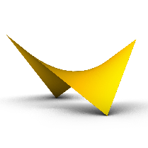

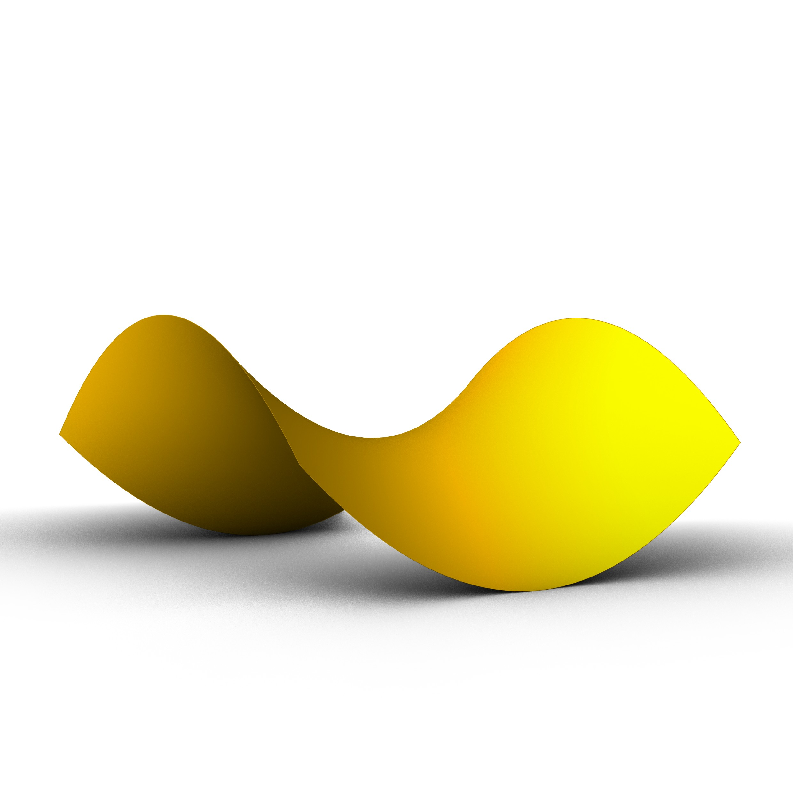

:::

:::{div}
:class: figure-1-caption

Hyperbolic Paraboloids

:::

## Built from straight elements

### Geometric property and form generation

The hyperbolic paraboloid is a doubly ruled surface. It contains two distinct families of straight rulings, each of which coincides with one family of asymptotic lines. The hyperbolic paraboloid can be generated from three straight lines that are two by two non coplanar. The four boundary rulings therefore form a skew quadrilateral. The two ruling families subdivide this skew quadrilateral into a mesh of smaller skew quadrilaterals. Each cell is bounded by four non-coplanar vertices.[@ferreol2019hp]

:::{div}
:class: figure-1

:::{div}
:class: figure-1-row

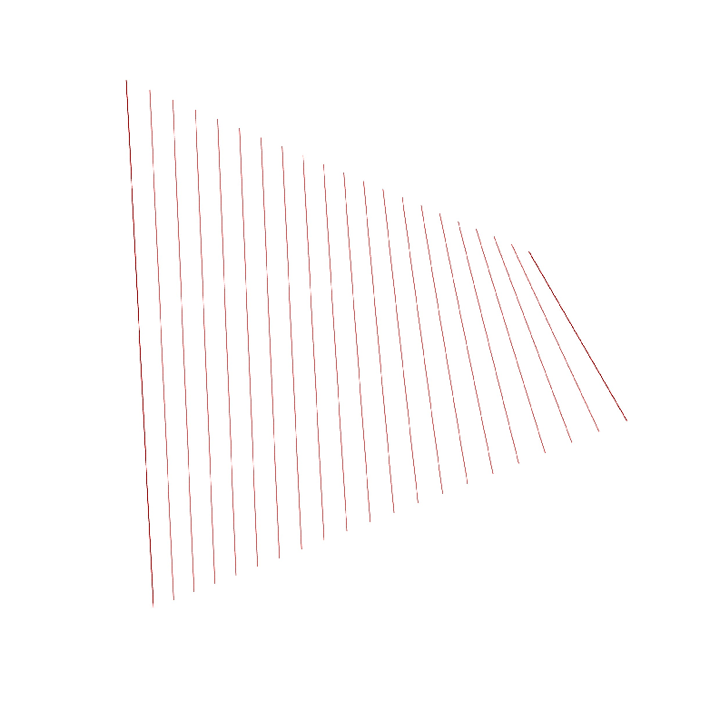

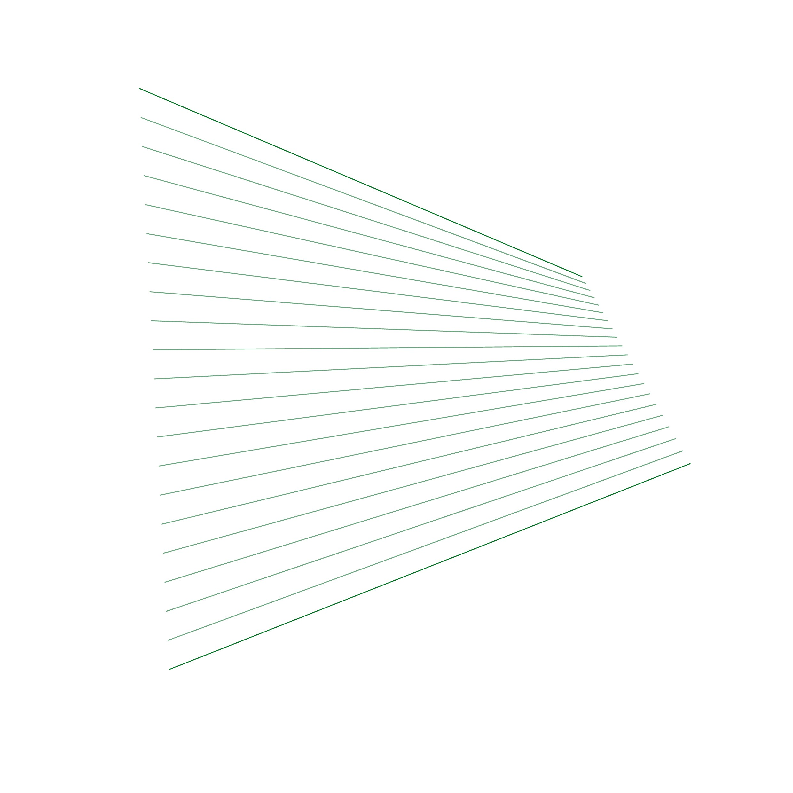

:::

:::{div}
:class: figure-1-caption

Doubly Ruled Surface

:::

The hyperbolic paraboloid can be generated from three straight lines. Two non-coplanar lines act as guide rails, while a third straight line sweeps between them. 

:::{div}
:class: figure-1

:::{div}
:class: figure-1-row

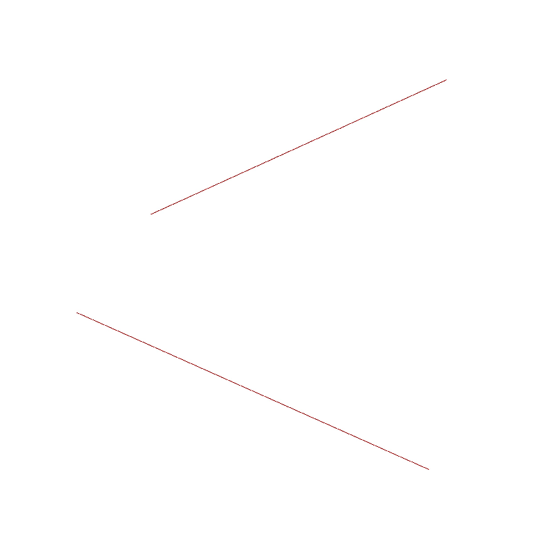

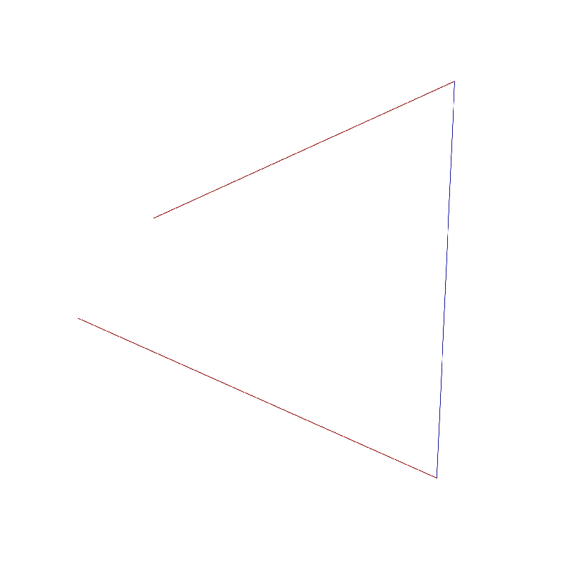

:::

:::{figure} ./images/ph_regles.mp4
:class: video-figure

:::

:::{div}
:class: figure-1-caption

Sweep Generation

:::

The two ruling families can be generated from the same pair of non-coplanar guide lines. Each guide line is divided into the same number of equal segments. Joining the corresponding division points generates the first ruling family. The second ruling family is obtained by repeating the same construction on the two boundary lines connecting the ends of the guide lines. Dividing these boundary lines into the same number of equal segments and joining the corresponding points generates the second family of rulings.
:::{div}
:class: figure-1

:::{div}
:class: figure-1-row

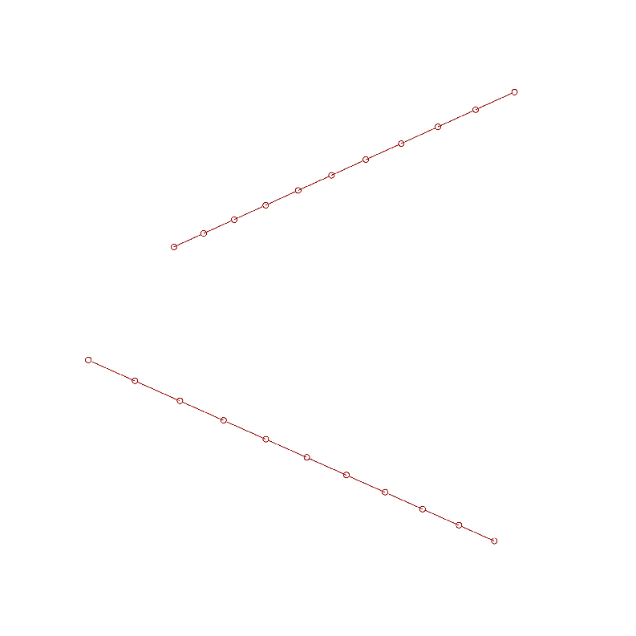

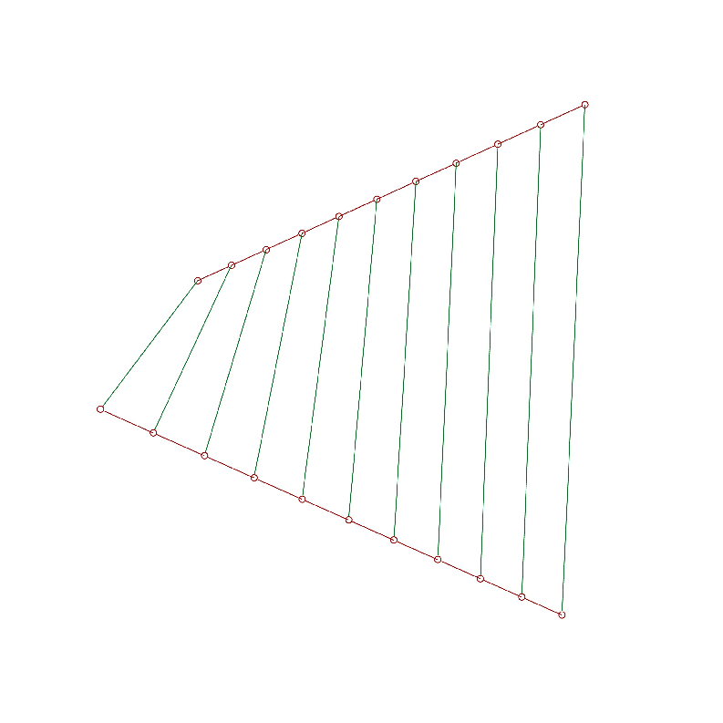

:::

:::{div}
:class: figure-1-row

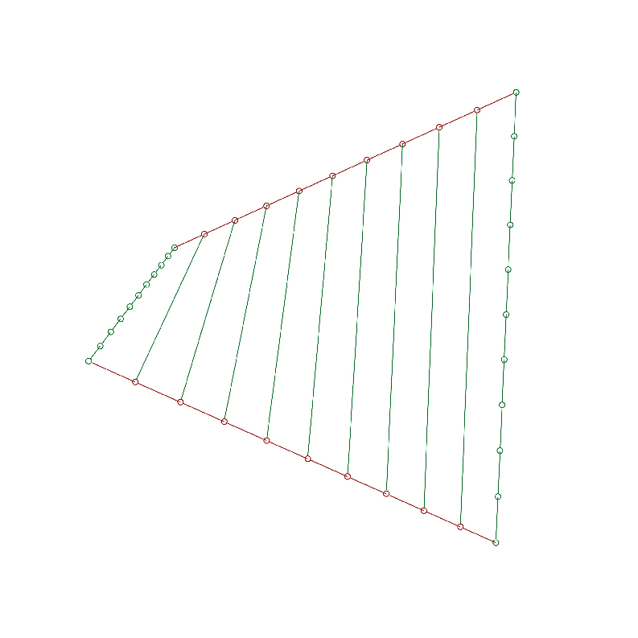

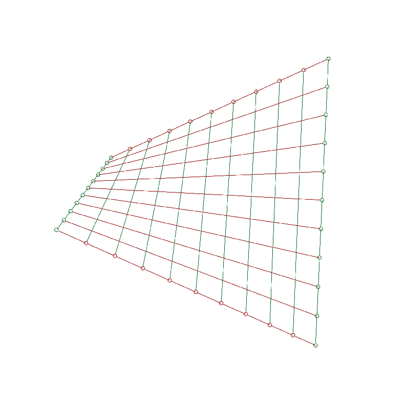

:::

:::{div}
:class: figure-1-caption

Generation of the two families of straight rulings

:::

### Building implications

The two ruling families provide a natural construction grid. This allows the surface to be built from straight elements despite its double curvature.

Since the quadrilateral cells of the mesh generated by the two rulings families are non-planar, they cannot be covered with flat quadrilateral panels without introducing geometric approximation or panel deformation.

### Gateway to the French subcamp at Eurojam 2003

:::{div}
:class: figure-2

:::{div}
:class: figure-2-image

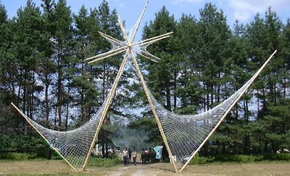

:::

The structure consists of two HP meeting at a common vertex. Its elements follow the grid defined by the two families of straight rulings.The four outer rulings define a rigid frame made of straight timber branches, while the inner rulings are materialized by two intersecting netwworks of taut straight ropes.

### Los Manantiales (Felix Candela)

:::{div}
:class: figure-2

:::{div}
:class: figure-2-image

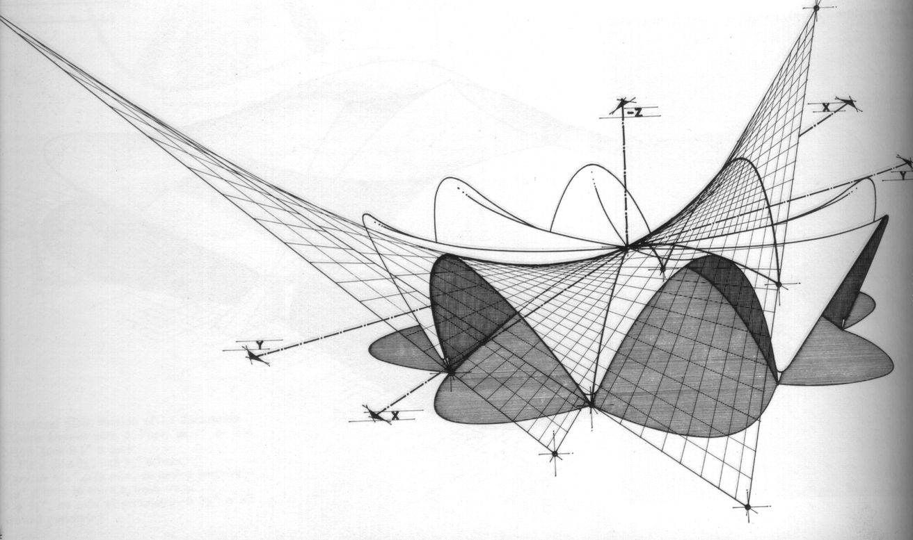

:::

Los Manantiales is composed of four trimmed hyperbolic paraboloids arranged by rotational symmetry around a central axis passing through the point where the four HP intersect.

:::{div}
:class: figure-2

:::{div}
:class: figure-2-image

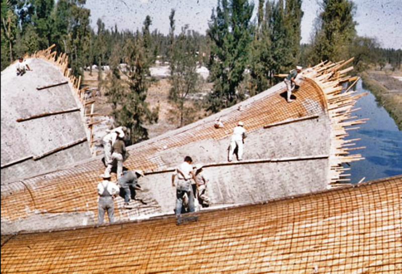

:::

The formwork is made of narrow wooden planks that follow one of the ruling families. The planks are not designed as a strip connecting two rulings, as these strips are not planar in a PH. Instead, each narrow plank is centred on a single ruling and given a small width, providing a close approximation of the surface [@giuroiu2024losmanantiales].  

## Structured by parabolic curves

### Geometric property and form generation

The hyperbolic paraboloid can be generated as a translation surface from two parabolas lying in perpendicular planes and opening in opposite directions. Translating either parabola along the other generates the same surface, the two curves therefore play interchangeable roles as generatrix and directrix.

:::{figure} ./images/ph_translation.mp4
:class: video-figure

Generation of a hyperbolic paraboloid by translating one parabola along another 
:::

A translation surface is generated by translating each of two curves along the other. By discretizing the two generating curves and connecting the resulting vertices, a quadrilateral mesh is obtained. Each cell of this mesh is planar.
Within a given cell, the displacement between two consecutive positions along one generating curve is reproduced identically on the opposite side. The same applies to the displacement along the other generating curve. The two pairs of opposite edges are therefore equal and parallel : each quadrilateral is a parallelogram and is consequently planar.

:::{div}
:class: figure-1-row

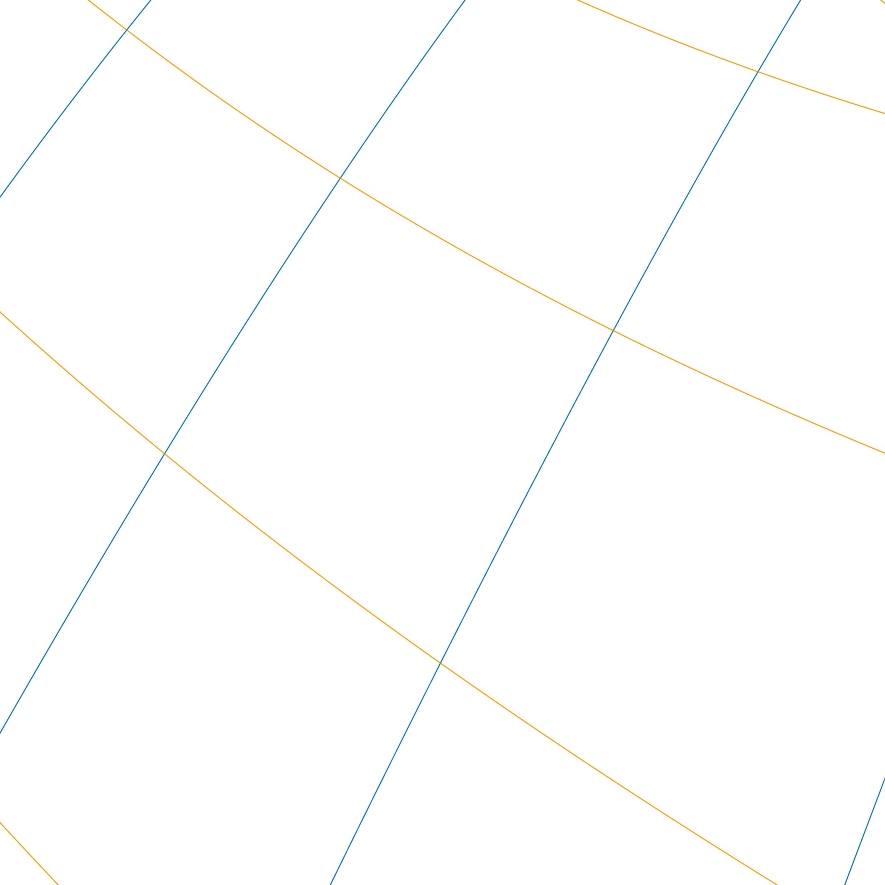

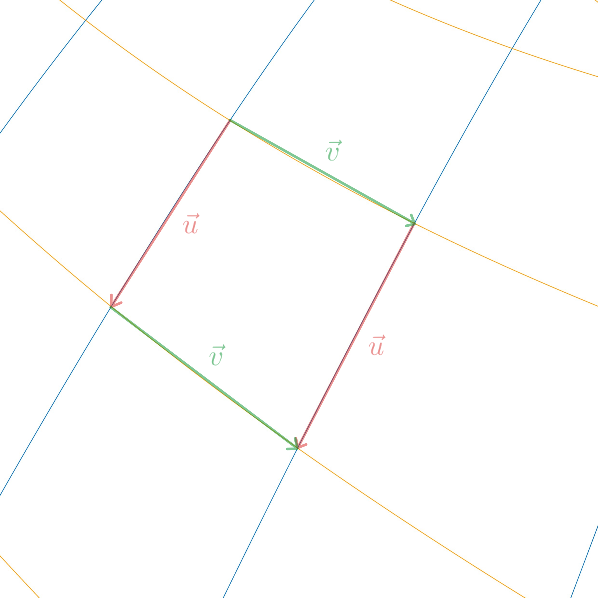

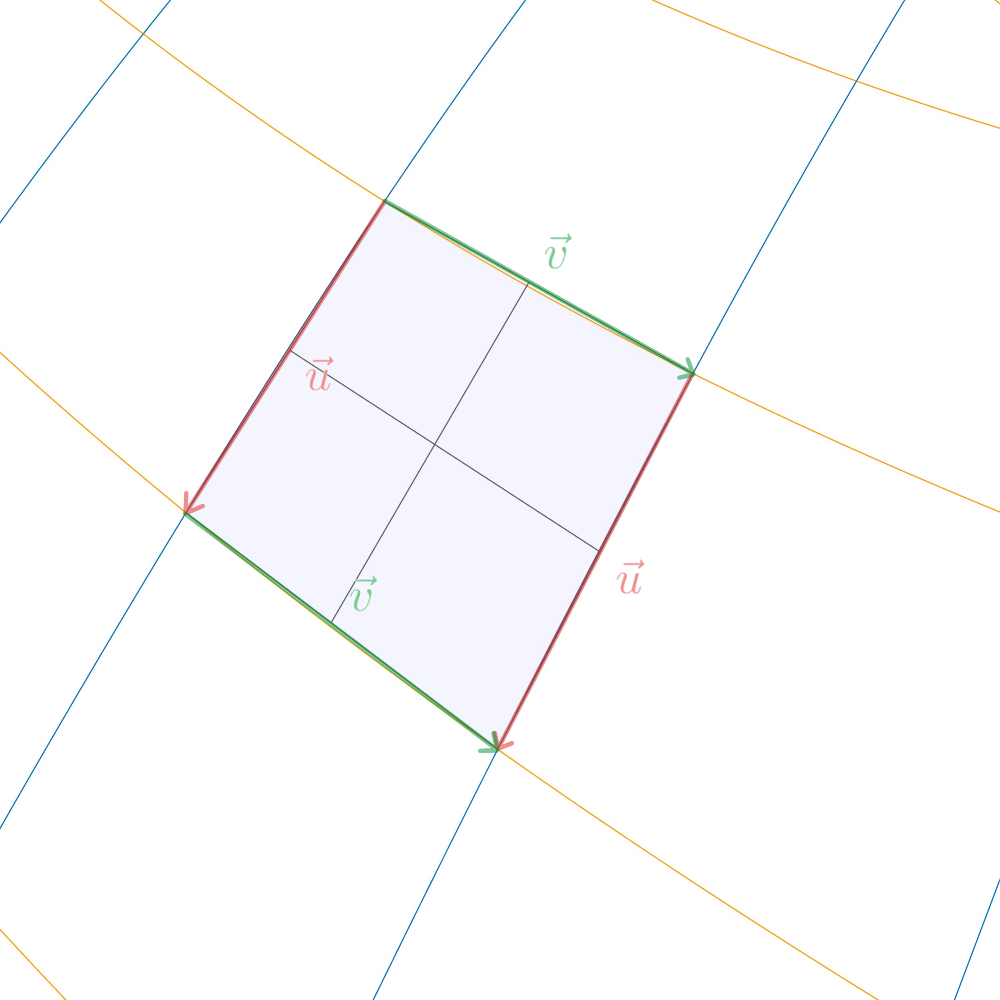

:::

:::{div}
:class: figure-1-caption

A mesh of planar quadrilaterals

:::

### Building implications

When materialized as a cable net following its two families of parabolic sections, the hyperbolic paraboloid can sustain a [self-equilibrated state of prestress](../../portals/form_force/pre_stressed/home.md)

$$
\frac{q_u}{q_v} = \frac{Bk^2}{Ah^2}
$$

**Geometric parameters**
- $A$ : 
- $B$ :

**Discretization parameters**  
Here, $i$ and $j$ are node indices, while $u_i$ and $v_j$ are the cartesian coordinates of their horizontal projections along the $u$ and $v$ directions. $P_{ij}$ denotes the spatial node formed by the intersection of two parabolas, and $(u_i,v_j)$ its projection onto the horizontal plane. These coordinates are not curvilinear coordinates measured along the parabolic cables. The network is uniformly discretized in the horizontal projection, using constant steps $h$ and $k$, consequently, the spatial lengths of the cable segments are generally not constant.
- $h$ : constant discretization step in the $u$-direction, such that $u_{i+1}-u_i = h$, where $u_i$ and $u_{i+1}$ are the $u$ coordinates of the horizontal projections of two consecutive nodes on the parabola $v=v_j$.
- $k$ : constant discretization step in the $v$-direction, such that $v_{j+1}-v_j = k$, where $v_j$ and $v_{j+1}$ are the $v$ coordinates of the horizontal projections of two consecutive nodes on the parabola $u=u_i$.